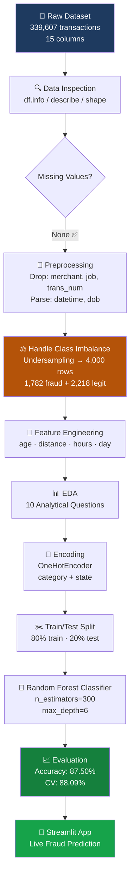

# 🛡️ FraudShield AI — Credit Card Fraud Detection

<div align="center">


**An end-to-end Machine Learning pipeline for detecting fraudulent credit card transactions — from raw imbalanced data to a live deployed web application.**

[🚀 Live Demo](https://fraudshield-ai-4ubnqdjfgs38uxdekzegtc.streamlit.app/) · [📄 Project Report](./ITDS_FraudDetection_Report_final.pdf) · [📊 Notebook](./notebook.ipynb)

</div>

---

## 📌 Table of Contents

- [Overview](#-overview)
- [Pipeline Architecture](#-pipeline-architecture)
- [Dataset](#-dataset)
- [Feature Engineering](#-feature-engineering)
- [EDA Highlights](#-eda-highlights)
- [Model & Results](#-model--results)
- [Project Structure](#-project-structure)
- [Getting Started](#-getting-started)
- [Team](#-team)

---

## 🔍 Overview

Credit card fraud causes **billions in global losses annually**. This project builds a production-ready fraud detection system using a real-world dataset of **339,607 transactions**.

The pipeline covers:
- Exploratory Data Analysis (10 investigative questions)
- Data preprocessing & class imbalance handling via **undersampling**
- Feature engineering (age, distance, hour, day-of-week)
- **Random Forest Classifier** training with scikit-learn Pipeline
- Live prediction app deployed on **Streamlit Cloud**

> **Subject:** Introduction to Data Science (ITDS) — Dawood University of Engineering & Technology, Karachi
> **Instructor:** Sir Jamal Shams Khanzada | **Batch:** 2024

---

## 🏗️ Pipeline Architecture



---

## 📦 Dataset

| Attribute | Details |
|-----------|---------|
| Source | Real-world labeled credit card transactions |
| Total Records | 339,607 rows → **4,000 rows** after undersampling |
| Total Columns | 15 original → **8 features** for modelling |
| Missing Values | **Zero** — dataset is completely clean |
| Class Imbalance | Only **0.52% fraud** (1,782 of 339,607 rows) |
| Target Variable | `is_fraud` — 0 = Legitimate, 1 = Fraudulent |

### Column Reference

| Column | Type | Used For |
|--------|------|----------|
| `trans_date_trans_time` | DateTime | Extract `hours`, `day` features |
| `amt` | Float | **Strongest predictor** (r = 0.64) |
| `category` | String | One-hot encoded (14 categories) |
| `state` | String | One-hot encoded; EDA analysis |
| `lat/long` + `merch_lat/merch_long` | Float | Compute `distance` feature |
| `dob` | DateTime | Compute `age` feature |
| `merchant`, `job`, `trans_num` | String | **Dropped** (high cardinality / non-predictive) |
| `is_fraud` | Int | Target variable |

---

## 🔧 Feature Engineering

Four new features were derived to boost predictive power:

| Feature | Derivation | Rationale |
|---------|-----------|-----------|
| `age` | `2026 − birth_year` from `dob` | Fraud propensity varies by age group |
| `distance` | Euclidean distance between customer & merchant coords | Fraud often occurs far from customer's home location |
| `hours` | Hour extracted from `trans_date_trans_time` | **Fraud peaks sharply at 22:00–23:00** |
| `day` | Day-of-week from `trans_date_trans_time` | Weekly patterns correlate with fraud likelihood |

After engineering, source columns (`lat`, `long`, `dob`, `merch_lat`, `merch_long`, `trans_date_trans_time`) were dropped — leaving **8 final features**.

---

## 📊 EDA Highlights

Ten questions were investigated. Key findings:

| # | Question | Key Finding |
|---|----------|-------------|
| Q1 | Transaction amount distribution | Right-skewed; most transactions 0–200 USD |
| Q3 | Category-wise fraud | `shopping_net` & `grocery_pos` most targeted |
| Q4 | City-wise fraud | Albuquerque (24), Aurora (23) lead |
| Q6 | State-wise fraud | **California (402 cases)** dominates |
| Q7 | Hourly fraud pattern | **Peak at 22:00–23:00** (459 & 452 cases) |
| Q8 | Monthly fraud pattern | March highest (220); November lowest (83) |
| Q9 | Yearly comparison | 2019: 978 cases → 2020: 804 cases (−17.8%) |
| Q10 | Amount vs Fraud correlation | Pearson r = **0.64** — strongest single feature |

> 💡 **Insight:** Fraud heavily clusters at **late-night hours**, in **online & grocery categories**, and in **California & Missouri**.

---

## 🤖 Model & Results

### Random Forest Configuration

```python
RandomForestClassifier(
    n_estimators=300,
    max_depth=6,
    min_samples_split=5,
    random_state=42
)
```

### scikit-learn Pipeline

```
ColumnTransformer (OneHotEncoder) → RandomForestClassifier
```

### Results

| Metric | Score |
|--------|-------|
| **Test Accuracy** | **87.50%** |
| **5-Fold CV Accuracy** | **88.09%** |
| Top Feature | `amt` (r = 0.64) |
| Overfitting | None detected |

### Key Takeaways

- `amt` (transaction amount) is the **strongest single predictor**
- Engineered features (`hours`, `distance`, `age`, `day`) meaningfully improved performance over raw columns
- Undersampling was critical — without it the model would have predicted "legitimate" for almost everything
- 5-fold cross-validation confirmed **consistent, generalizable** results

---

## 📁 Project Structure

```
fraudshield-ai/
├── app.py                          # Streamlit web application
├── notebook.ipynb                  # Full EDA + ML pipeline notebook
├── credit_card_frauds.csv          # Dataset (not tracked in git)
├── model/
│   └── fraud_model.pkl             # Trained Random Forest pipeline
├── ITDS_FraudDetection_Report_final.pdf
├── requirements.txt
└── README.md
```

---

## 🚀 Getting Started

### Prerequisites

```bash
Python 3.10+
```

### Installation

```bash
# Clone the repository
git clone https://github.com/saadullahmemon900-dot/fraudshield-ai.git
cd fraudshield-ai

# Install dependencies
pip install -r requirements.txt

# Run the Streamlit app
streamlit run app.py
```

### requirements.txt (recommended)

```
pandas
numpy
scikit-learn
streamlit
matplotlib
seaborn
joblib
```

---

## 👥 Team

| # | Name | Roll Number |
|---|------|-------------|
| 01 | Anamta Saleem | 24F-DS-135 |
| 02 | Javeria Ali | 24F-DS-111 |
| 03 | Saadullah | 24F-DS-068 |

**Department of Data Science** — Dawood University of Engineering & Technology, Karachi
**Course:** Introduction to Data Science (ITDS) | **Instructor:** Sir Jamal Shams Khanzada | **Batch:** 2024

---

## 🔮 Future Improvements

- [ ] Replace undersampling with **SMOTE** (Synthetic Minority Oversampling) for better minority class representation
- [ ] Try **XGBoost / LightGBM** for potentially higher accuracy
- [ ] Add **Precision, Recall, F1-Score, and ROC-AUC** to evaluation (accuracy alone is insufficient for fraud)
- [ ] Implement **real-time streaming** detection
- [ ] Add **SHAP values** for model explainability

---

<div align="center">

Made with ❤️ at DUET Karachi · [🚀 Try the Live App](https://fraudshield-ai-4ubnqdjfgs38uxdekzegtc.streamlit.app/)

</div>
